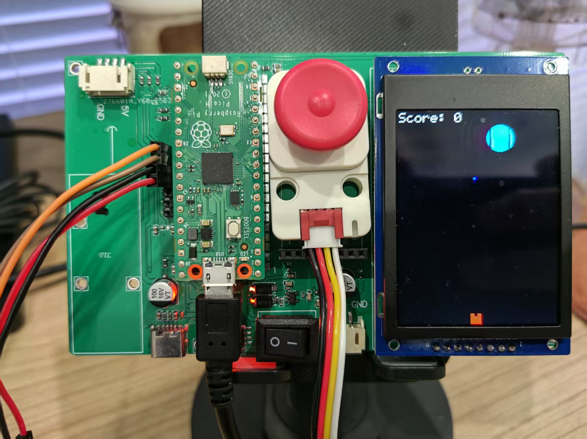

# Joystick_Pico Driver


English | [中文](README.zh.md)


This is a driver for the Raspberry Pi Pico platform that supports both joystick module and ST7789 display. The driver provides comprehensive joystick control, button detection, direction recognition, RGB status indication, and display support.

## Features

### Joystick Module
- I2C communication (default 100kHz, configurable)
- 12-bit and 8-bit ADC value reading
- Enhanced direction detection (up, down, left, right, center)
- Advanced debouncing and stability algorithms
- Button state detection
- RGB LED status indication
- Calibration capabilities
- Complete error handling
- Direction stability enhancements

### ST7789 Display
- SPI communication interface
- Support for multiple resolutions
- Built-in display buffer
- Basic graphics drawing support
- Text display support
- Image display support

## Hardware Requirements

- Raspberry Pi Pico
- Joystick module (I2C interface)
- ST7789 display (optional)
- Connection cables (SDA, SCL, VCC, GND)

## Pin Connections

### Joystick Module
| Pico Pin | Joystick Pin | Description |
|----------|--------------|-------------|
| GPIO6    | SDA          | I2C data line |
| GPIO7    | SCL          | I2C clock line |
| 3V3      | VCC          | Power positive |
| GND      | GND          | Power negative |

### ST7789 Display
| Pico Pin | Display Pin | Description |
|----------|-------------|-------------|
| GPIO16   | SCLK        | SPI clock line |
| GPIO17   | MOSI        | SPI data line |
| GPIO18   | CS          | Chip select |
| GPIO19   | DC          | Data/Command select |
| GPIO20   | RST         | Reset signal |
| 3V3      | VCC         | Power positive |
| GND      | GND         | Power negative |

## Quick Start

1. Include the header and create an instance
```cpp
#include "joystick.hpp"
Joystick joystick;
```

2. Initialize the device
```cpp
// Using i2c1, Address 0x63, SDA Pin 6, SCL Pin 7
joystick.begin(i2c1, 0x63, 6, 7); 
```

3. Main loop example
```cpp
while (true) {
    // Read joystick data
    uint16_t adc_x, adc_y;
    joystick.get_joy_adc_16bits_value_xy(&adc_x, &adc_y);
    
    // Read offset values (calibrated position)
    int16_t offset_x = joystick.get_joy_adc_12bits_offset_value_x();
    int16_t offset_y = joystick.get_joy_adc_12bits_offset_value_y();
    
    // Read button state (0=pressed, 1=not pressed)
    uint8_t button = joystick.get_button_value();
    
    // Process direction
    // ... direction determination code ...
    
    // Set LED based on operation state
    joystick.set_rgb_color(0x0000FF); // Blue LED
    
    sleep_ms(20);
}
```

## Status LED Usage

- Green: Device working normally/initialization successful
- Blue: Active joystick operation
- Off: No operation/idle state

## API Reference

### Initialization
```cpp
bool begin(i2c_inst_t *i2c_port, uint8_t addr = 0x63, uint sda_pin = 21, uint scl_pin = 22, uint32_t speed = 400000UL);
```

### Data Reading
```cpp
uint16_t get_joy_adc_value_x(adc_mode_t adc_bits);
uint16_t get_joy_adc_value_y(adc_mode_t adc_bits);
void get_joy_adc_16bits_value_xy(uint16_t *adc_x, uint16_t *adc_y);
void get_joy_adc_8bits_value_xy(uint8_t *adc_x, uint8_t *adc_y);
uint8_t get_button_value(void);
```

### Offset (Calibrated) Values
```cpp
int16_t get_joy_adc_12bits_offset_value_x(void);
int16_t get_joy_adc_12bits_offset_value_y(void);
int8_t get_joy_adc_8bits_offset_value_x(void);
int8_t get_joy_adc_8bits_offset_value_y(void);
```

### Status Control
```cpp
void set_rgb_color(uint32_t color);
uint32_t get_rgb_color(void);
```

### Calibration Functions
```cpp
void set_joy_adc_value_cal(uint16_t x_neg_min, uint16_t x_neg_max, uint16_t x_pos_min,
                          uint16_t x_pos_max, uint16_t y_neg_min, uint16_t y_neg_max,
                          uint16_t y_pos_min, uint16_t y_pos_max);
                          
void get_joy_adc_value_cal(uint16_t *x_neg_min, uint16_t *x_neg_max, uint16_t *x_pos_min,
                          uint16_t *x_pos_max, uint16_t *y_neg_min, uint16_t *y_neg_max,
                          uint16_t *y_pos_min, uint16_t *y_pos_max);
```

### Version Information
```cpp
uint8_t get_firmware_version(void);
uint8_t get_bootloader_version(void);
uint8_t get_i2c_address(void);
uint8_t set_i2c_address(uint8_t new_addr);
```

## Enhanced Direction Detection & Debouncing

The latest version includes advanced debouncing and stability features:

- **Direction detection with enhanced stability:**
  - Higher threshold for detecting valid movement (1800 vs previous 1500)
  - Improved direction ratio calculation for more reliable detection
  - Special handling for "up" direction with customized sensitivity
  - Deadzone implementation to reduce jitter
  
- **Advanced debouncing algorithm:**
  - Requires 3 consecutive same readings to consider a direction stable
  - Needs 5 stable center readings to confirm true joystick release
  - Gradual stability counter reduction instead of immediate reset
  - Separate tracking for active direction and release state

- **Continuous operation support:**
  - Allows repeated output when holding a direction
  - Controls output frequency with configurable interval (250ms)
  - Immediate output on direction change

## Configuration

Key parameters in `main.cpp`:
```cpp
#define JOYSTICK_THRESHOLD 1800  // Increased threshold to reduce false triggers
#define LOOP_DELAY_MS 20         // Loop delay time (milliseconds)
#define PRINT_INTERVAL_MS 250    // Repeat print interval (milliseconds)
#define DIRECTION_RATIO 1.5      // Direction determination ratio
```

## Building and Flashing

1. Set up the Raspberry Pi Pico SDK
2. Run the `build_pico.bat` script to build
3. Copy the generated `.uf2` file to the Pico when in BOOTSEL mode

## Example Code

The project provides two main examples demonstrating different use cases:

### 1. Basic Joystick Test Example (`examples/joystick_test.cpp`)

This example demonstrates the basic functionality of the joystick, including:
- Direction detection (up, down, left, right, center)
- Button state detection
- LED status indication
- Advanced debouncing algorithm

Key features:
- Uses enhanced direction detection algorithm for improved stability
- Implements intelligent debouncing mechanism
- Supports continuous operation and immediate response
- Indicates operation state through LED

### 2. Joystick with Display Integration Example (`examples/CollisionX.cpp`)

This example implements an interesting physics-based collision game, demonstrating how to integrate the joystick with the ST7789 display.

#### Game Rules

1. **Game Objective**:
   - Use the joystick to control coordinate movement and place blue blocks
   - Long press the joystick Mid button (3 seconds) to release the green ball
   - Prevent the ball from hitting the boundaries by strategically placing limited blue blocks within the time limit

2. **Game Elements**:
   - Green dot: System-generated character
   - Blue blocks: Characters used to protect the ball from hitting boundaries
   - Red lines: Upper and lower boundaries
   - Timer: 20-second countdown display
   - Remaining blocks counter: Shows the number of available blocks

3. **Game Mechanics**:
   - Each blue block requires two collisions to disappear
   - Green dot bounces off left and right boundaries
   - Green dot bounces off blue blocks
   - Game time is 20 seconds
   - Victory is achieved if the green ball survives without hitting boundaries within 20 seconds

4. **​Control Scheme**:
   - ​Long-press​​ the joystick's ​​middle button (MID)​​ for 3 seconds then release to deploy the ball
   - Use the joystick to ​​place blocks​


#### Technical Implementation

1. **Physics System**:
   - Implements basic physics collision detection
   - Supports multiple dots moving simultaneously
   - Implements boundary collision and bounce effects

2. **Display System**:
   - Real-time game screen updates
   - Displays timer and score
   - Supports dynamic graphics drawing

3. **Control System**:
   - Precise control using joystick
   - Implements smooth movement control
   - Supports multi-directional simultaneous input

4. **Game State Management**:
   - Tracks state of all game elements
   - Manages collision detection and response
   - Handles game start and end logic

### Example Program Feature Comparison

| Feature | Basic Test Example | Display Integration Example |
|---------|-------------------|----------------------------|
| Direction Detection | ✓ | ✓ |
| Button Detection | ✓ | ✓ |
| LED Indication | ✓ | - |
| Display Support | - | ✓ |
| Physics Simulation | - | ✓ |
| Collision Detection | - | ✓ |
| Game Logic | - | ✓ |
| Real-time Display | - | ✓ |

### 3. PicoPilot Game (`examples/PicoPilot.cpp`)

#### Game Description
This is a simple shooting game based on Raspberry Pi Pico and ST7789 display. The player controls a spaceship to shoot at a moving target at the top of the screen.

#### Game Rules
1. At the start of the game, a moving ball target appears at the top of the screen.
2. The ball moves horizontally at a random speed and bounces off the screen edges.
3. The ball must be hit 5 times to disappear completely:
   - Initial state: ball size is 5x
   - First hit: size becomes 4x
   - Second hit: size becomes 3x
   - Third hit: size becomes 2x
   - Fourth hit: size becomes 1x
   - Fifth hit: target disappears and a victory message is shown

#### Controls
- Use the joystick to move the spaceship:
  - Up: move up
  - Down: move down
  - Left: move left
  - Right: move right
- Press the joystick middle button to fire a missile

#### Scoring
- Each hit on the target earns points
- The score is based on the current size of the target:
  - 5x size: 5 points
  - 4x size: 4 points
  - 3x size: 3 points
  - 2x size: 2 points
  - 1x size: 1 point

#### Game Over
- When the target is hit 5 times, "You Win!" is displayed
- Press the middle button to restart the game

#### Hardware Requirements
- Raspberry Pi Pico
- ST7789 display
- Joystick controller

#### Wiring
Display:
- MOSI: GPIO19
- SCK: GPIO18
- CS: GPIO17
- DC: GPIO20
- RESET: GPIO15
- Backlight: GPIO10

Joystick:
- Connected via I2C
- SDA and SCL pins as configured

#### Build and Run
1. Make sure the Raspberry Pi Pico SDK is installed
2. Create a build folder in the project directory:
   ```bash
   mkdir build
   cd build
   ```
3. Run CMake configuration:
   ```bash
   cmake ..
   ```
4. Build the project:
   ```bash
   make
   ```
5. Flash the generated .uf2 file to the Pico board

#### Notes
- The game requires a stable power supply
- Ensure the display and joystick are connected correctly
- If the game is unstable, try lowering the refresh rate

## Notes

1. Green LED flash indicates successful initialization
2. Blue LED shows active operation, automatically turning off upon release
3. Configure parameters for your specific hardware sensitivity
4. The debouncing algorithm balances responsiveness with stability
5. Ensure adequate power supply when using the display

## License

MIT License

## Contributions

Issues and Pull Requests are welcome to improve this project. 