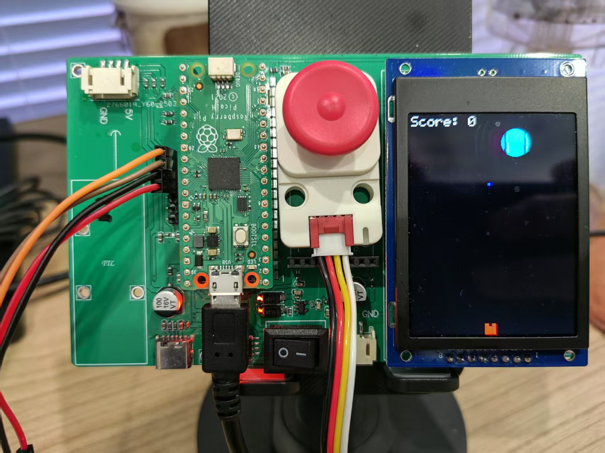

# Joystick_Pico Driver


[English](README.md) | 中文


这是一个用于树莓派 Pico 平台的摇杆模块和 ST7789 显示屏驱动程序。该驱动提供了完整的摇杆控制、按钮检测、方向识别、RGB 状态指示以及显示屏支持。

## 功能特点

### 摇杆模块
- I2C 通信（默认 100kHz，可配置）
- 12位和 8位 ADC 值读取
- 增强的方向检测（上、下、左、右、中心）
- 高级去抖动和稳定性算法
- 按钮状态检测
- RGB LED 状态指示
- 校准功能
- 完整的错误处理
- 方向稳定性增强

### ST7789 显示屏
- SPI 通信接口
- 支持多种分辨率
- 内置显示缓冲区
- 支持基本图形绘制
- 支持文本显示
- 支持图片显示

## 硬件要求

- 树莓派 Pico
- 摇杆模块（I2C 接口）
- ST7789 显示屏（可选）
- 连接线（SDA、SCL、VCC、GND）

## 引脚连接

### 摇杆模块
| Pico 引脚 | 摇杆引脚 | 描述 |
|----------|----------|------|
| GPIO6    | SDA      | I2C 数据线 |
| GPIO7    | SCL      | I2C 时钟线 |
| 3V3      | VCC      | 电源正极 |
| GND      | GND      | 电源负极 |

### ST7789 显示屏
| Pico 引脚 | 显示屏引脚 | 描述 |
|----------|------------|------|
| GPIO16   | SCLK      | SPI 时钟线 |
| GPIO17   | MOSI      | SPI 数据线 |
| GPIO18   | CS        | 片选信号 |
| GPIO19   | DC        | 数据/命令选择 |
| GPIO20   | RST       | 复位信号 |
| 3V3      | VCC       | 电源正极 |
| GND      | GND       | 电源负极 |

## Quick Start

1. Include the header and create an instance
```cpp
#include "joystick.hpp"
Joystick joystick;
```

2. Initialize the device
```cpp
// Using i2c1, Address 0x63, SDA Pin 6, SCL Pin 7
joystick.begin(i2c1, 0x63, 6, 7); 
```

3. Main loop example
```cpp
while (true) {
    // Read joystick data
    uint16_t adc_x, adc_y;
    joystick.get_joy_adc_16bits_value_xy(&adc_x, &adc_y);
    
    // Read offset values (calibrated position)
    int16_t offset_x = joystick.get_joy_adc_12bits_offset_value_x();
    int16_t offset_y = joystick.get_joy_adc_12bits_offset_value_y();
    
    // Read button state (0=pressed, 1=not pressed)
    uint8_t button = joystick.get_button_value();
    
    // Process direction
    // ... direction determination code ...
    
    // Set LED based on operation state
    joystick.set_rgb_color(0x0000FF); // Blue LED
    
    sleep_ms(20);
}
```

## Status LED Usage

- Green: Device working normally/initialization successful
- Blue: Active joystick operation
- Off: No operation/idle state

## API Reference

### Initialization
```cpp
bool begin(i2c_inst_t *i2c_port, uint8_t addr = 0x63, uint sda_pin = 21, uint scl_pin = 22, uint32_t speed = 400000UL);
```

### Data Reading
```cpp
uint16_t get_joy_adc_value_x(adc_mode_t adc_bits);
uint16_t get_joy_adc_value_y(adc_mode_t adc_bits);
void get_joy_adc_16bits_value_xy(uint16_t *adc_x, uint16_t *adc_y);
void get_joy_adc_8bits_value_xy(uint8_t *adc_x, uint8_t *adc_y);
uint8_t get_button_value(void);
```

### Offset (Calibrated) Values
```cpp
int16_t get_joy_adc_12bits_offset_value_x(void);
int16_t get_joy_adc_12bits_offset_value_y(void);
int8_t get_joy_adc_8bits_offset_value_x(void);
int8_t get_joy_adc_8bits_offset_value_y(void);
```

### Status Control
```cpp
void set_rgb_color(uint32_t color);
uint32_t get_rgb_color(void);
```

### Calibration Functions
```cpp
void set_joy_adc_value_cal(uint16_t x_neg_min, uint16_t x_neg_max, uint16_t x_pos_min,
                          uint16_t x_pos_max, uint16_t y_neg_min, uint16_t y_neg_max,
                          uint16_t y_pos_min, uint16_t y_pos_max);
                          
void get_joy_adc_value_cal(uint16_t *x_neg_min, uint16_t *x_neg_max, uint16_t *x_pos_min,
                          uint16_t *x_pos_max, uint16_t *y_neg_min, uint16_t *y_neg_max,
                          uint16_t *y_pos_min, uint16_t *y_pos_max);
```

### Version Information
```cpp
uint8_t get_firmware_version(void);
uint8_t get_bootloader_version(void);
uint8_t get_i2c_address(void);
uint8_t set_i2c_address(uint8_t new_addr);
```

## Enhanced Direction Detection & Debouncing

The latest version includes advanced debouncing and stability features:

- **Direction detection with enhanced stability:**
  - Higher threshold for detecting valid movement (1800 vs previous 1500)
  - Improved direction ratio calculation for more reliable detection
  - Special handling for "up" direction with customized sensitivity
  - Deadzone implementation to reduce jitter
  
- **Advanced debouncing algorithm:**
  - Requires 3 consecutive same readings to consider a direction stable
  - Needs 5 stable center readings to confirm true joystick release
  - Gradual stability counter reduction instead of immediate reset
  - Separate tracking for active direction and release state

- **Continuous operation support:**
  - Allows repeated output when holding a direction
  - Controls output frequency with configurable interval (250ms)
  - Immediate output on direction change

## Configuration

Key parameters in `main.cpp`:
```cpp
#define JOYSTICK_THRESHOLD 1800  // Increased threshold to reduce false triggers
#define LOOP_DELAY_MS 20         // Loop delay time (milliseconds)
#define PRINT_INTERVAL_MS 250    // Repeat print interval (milliseconds)
#define DIRECTION_RATIO 1.5      // Direction determination ratio
```

## Building and Flashing

1. Set up the Raspberry Pi Pico SDK
2. Run the `build_pico.bat` script to build
3. Copy the generated `.uf2` file to the Pico when in BOOTSEL mode

## Notes

1. The green LED flash indicates successful initialization
2. Blue LED shows active operation, automatically turning off upon release
3. Configure parameters for your specific hardware sensitivity
4. The debouncing algorithm balances responsiveness with stability

## Example Code

项目提供了两个主要示例，展示了不同的使用场景：

### 1. 基础摇杆测试示例 (`examples/joystick_test.cpp`)

这个示例展示了摇杆的基本功能，包括：
- 方向检测（上、下、左、右、中心）
- 按钮状态检测
- LED 状态指示
- 高级去抖动算法

主要特点：
- 使用增强的方向检测算法，提高稳定性
- 实现了智能去抖动机制
- 支持连续操作和即时响应
- 通过 LED 指示操作状态

### 2. 摇杆与显示屏集成示例 (`examples/joystick_st7789.cpp`)

这个示例实现了一个有趣的物理碰撞游戏，展示了如何将摇杆与 ST7789 显示屏结合使用。

#### 游戏规则

1. **游戏目标**：
   - 使用摇杆控制坐标移动并放置蓝色方块
   - 长按摇杆Mid键（三秒）释放绿色小球
   - 通过合理放置有限的蓝色方块来阻止小球不碰撞边线，在限定时间内存活

2. **游戏元素**：
   - 绿色圆点：由系统自动生成的角色
   - 蓝色方块：用于保护小球不碰撞边界的角色
   - 红色线条：上下边界
   - 计时器：20秒倒计时显示
   - 剩余方块计数器：显示剩余可用的方块数量

3. **游戏机制**：
   - 每个蓝色方块需要被碰撞两次才会消失
   - 绿色圆点碰到左右边界后会反弹
   - 绿色圆点碰到蓝色方块后会反弹
   - 游戏时间为20秒
   - 20秒内，绿色小球未碰撞边界为胜利否则失败

4. **控制方式**：
   - 长按摇杆mid键三秒释放小球
   - 使用摇杆放置方块

#### 技术实现

1. **物理系统**：
   - 实现了基本的物理碰撞检测
   - 支持多个圆点的同时运动
   - 实现了边界碰撞和反弹效果

2. **显示系统**：
   - 实时更新游戏画面
   - 计时器和存量显示
   - 支持动态图形绘制

3. **控制系统**：
   - 使用摇杆进行精确控制
   - 实现了平滑的移动控制
   - 支持多方向同时输入

4. **游戏状态管理**：
   - 跟踪所有游戏元素的状态
   - 管理碰撞检测和响应
   - 处理游戏开始和结束逻辑

### 示例程序的主要功能对比

| 功能特性 | 基础测试示例 | 显示屏集成示例 |
|---------|------------|--------------|
| 方向检测 | ✓ | ✓ |
| 按钮检测 | ✓ | ✓ |
| LED 指示 | ✓ | - |
| 显示屏支持 | - | ✓ |
| 物理模拟 | - | ✓ |
| 碰撞检测 | - | ✓ |
| 游戏逻辑 | - | ✓ |
| 实时显示 | - | ✓ |

## License

MIT License

## Contributions

Issues and Pull Requests are welcome to improve this project. 

## 示例代码

项目提供了两个主要示例：

1. `examples/joystick_test.cpp` - 基础摇杆测试示例
2. `examples/joystick_st7789.cpp` - 摇杆与显示屏集成示例

### 基础摇杆示例
```cpp
#include "joystick.hpp"
Joystick joystick;

int main() {
    // 初始化摇杆
    joystick.begin(i2c1, 0x63, 6, 7);
    
    while (true) {
        // 读取摇杆数据
        uint16_t adc_x, adc_y;
        joystick.get_joy_adc_16bits_value_xy(&adc_x, &adc_y);
        
        // 读取按钮状态
        uint8_t button = joystick.get_button_value();
        
        sleep_ms(20);
    }
}
```

### 摇杆与显示屏集成示例
```cpp
#include "joystick.hpp"
#include "st7789.hpp"

Joystick joystick;
ST7789 display;

int main() {
    // 初始化摇杆
    joystick.begin(i2c1, 0x63, 6, 7);
    
    // 初始化显示屏
    display.begin(16, 17, 18, 19, 20);
    
    while (true) {
        // 读取摇杆数据并在显示屏上显示
        uint16_t adc_x, adc_y;
        joystick.get_joy_adc_16bits_value_xy(&adc_x, &adc_y);
        
        // 在显示屏上绘制摇杆位置
        display.clear();
        display.draw_circle(adc_x/256, adc_y/256, 5, 0xFFFF);
        display.update();
        
        sleep_ms(20);
    }
}
``` 